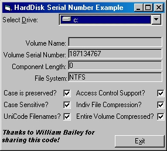



## HardDisk Serial Number

### Description

This snippet/wrapper will show the use of the GetVolumeInformation API call, for those not immediately familiar with it.
 
### More Info
 
Input: Drive Letter

Returns: Volume information including the Serial Number, Name, File System, Compression Used, ...

None known. Developed with VB6 on Win2K

             |
---                |---
**Submitted On**   |2002-03-06 03:27:16
**By**             |[Kevin Bowker](https://github.com/Planet-Source-Code/PSCIndex/blob/master/ByAuthor/kevin-bowker.md)
**Level**          |Intermediate
**User Rating**    |5.0 (10 globes from 2 users)
**Compatibility**  |VB 4\.0 \(32\-bit\), VB 5\.0, VB 6\.0
**Category**       |[Windows API Call/ Explanation](https://github.com/Planet-Source-Code/PSCIndex/blob/master/ByCategory/windows-api-call-explanation__1-39.md)
**World**          |[Visual Basic](https://github.com/Planet-Source-Code/PSCIndex/blob/master/ByWorld/visual-basic.md)
**Archive File**   |[HardDisk\_S59717362002\.zip](https://github.com/Planet-Source-Code/kevin-bowker-harddisk-serial-number__1-32392/archive/master.zip)

### API Declarations

GetVolumeInformation

